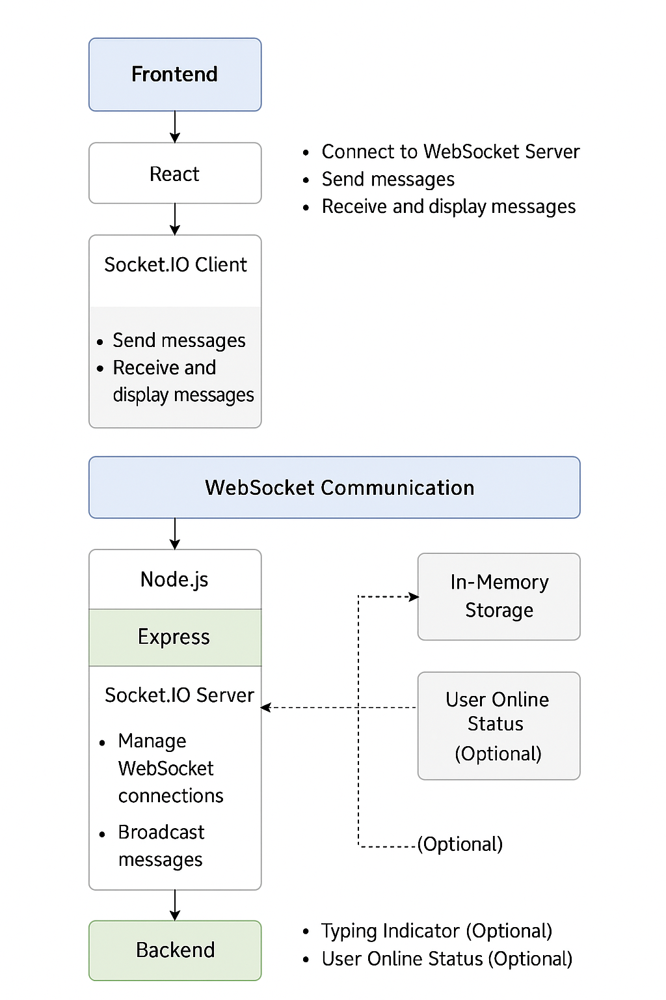

# ✨ Full Stack Realtime Chat App ✨

A full-stack real-time chat application built with **Node.js**, **Express**, **React.js**, and **Socket.IO**. It supports live messaging, chat history, and a responsive UI for both desktop and mobile devices.

---

## 🚩 Features

- 🌟 MERN stack: MongoDB, Express, React, Node.js
- 🎃 Authentication & Authorization with JWT
- 👾 Real-time messaging with Socket.io
- 🚀 Online user status
- 👌 Global state management with Zustand
- 🐞 Robust error handling (server & client)
- 🎨 Responsive UI with TailwindCSS & DaisyUI

---

## 🗂️ Project Structure

```
fullstack-chat-app/
  backend/      # Express.js server, API, Socket.io, MongoDB models
  frontend/     # React.js client, Zustand, TailwindCSS
```

---

## 🏛️ Architecture



---
```
# =============================
#   Real-Time Chat App Flow
# =============================

# --- Frontend (React.js) ---
Frontend/
├── React App
│   ├── Chat UI
│   ├── Message Input Box
│   ├── Message List Display
│   └── Connects to Socket.IO Client
└── Socket.IO Client
    ├── Sends messages to backend
    └── Receives real-time updates

# --- WebSocket Communication Layer ---
WebSocket (Socket.IO)
├── Real-time message transmission
└── Bi-directional event-based communication

# --- Backend (Node.js + Express) ---
Backend/
├── Node.js + Express Server
│   ├── Socket.IO Server
│   │   ├── Handles client connections
│   │   ├── Listens to messages
│   │   └── Broadcasts messages to other clients
│   └── (Optional) REST APIs (e.g., for loading chat history)
├── In-Memory Storage (Optional)
│   └── Store messages or connected users
└── Optional Features
    ├── Typing Indicator
    └── User Online Status

# --- Data Flow Summary ---
# Frontend sends message ---> WebSocket ---> Backend
# Backend broadcasts message ---> WebSocket ---> Frontend
```

## 🛠️ Installation & Setup Instructions

### 1. Clone the Repository

```
# 📦 Clone the repository
git clone https://github.com/arjunshettyz/fullstack-chat-app.git
cd fullstack-chat-app
```

### 2. Setup Backend

```
cd backend
npm install        # Install backend dependencies
npm run dev        # Start the backend server (default: http://localhost:5001)
```

### 3. Setup Frontend (in a new terminal)

```
cd frontend
npm install        # Install frontend dependencies
npm run dev        # Start the frontend dev server (default: http://localhost:3000)
```

---

## ⚙️ Setup .env file (Backend)

Create a `.env` file in the `backend/` directory with the following:

```
MONGODB_URI=your_mongodb_uri
PORT=5001
JWT_SECRET=your_jwt_secret

CLOUDINARY_CLOUD_NAME=your_cloudinary_name
CLOUDINARY_API_KEY=your_cloudinary_api_key
CLOUDINARY_API_SECRET=your_cloudinary_api_secret

NODE_ENV=development
```

---

Happy chatting! 🎉

